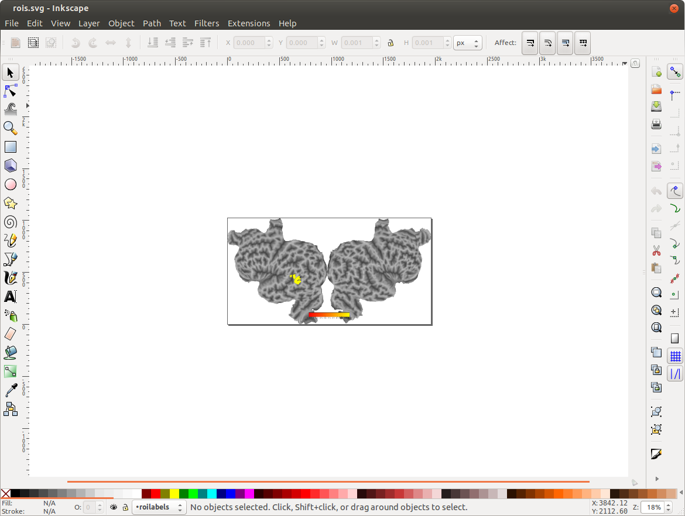
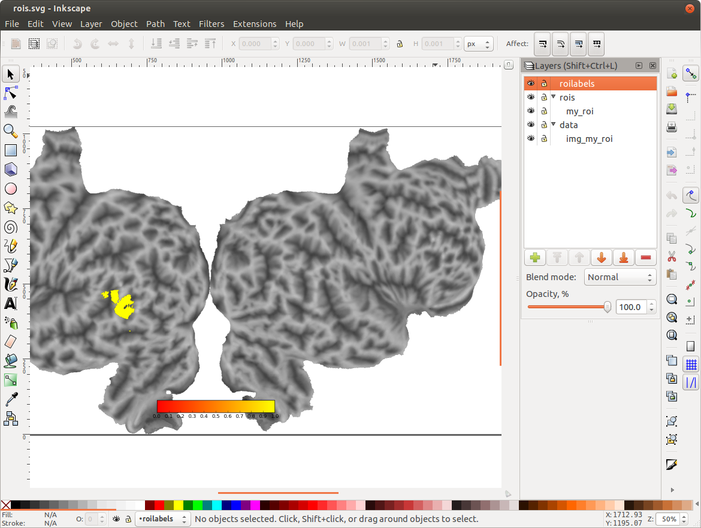
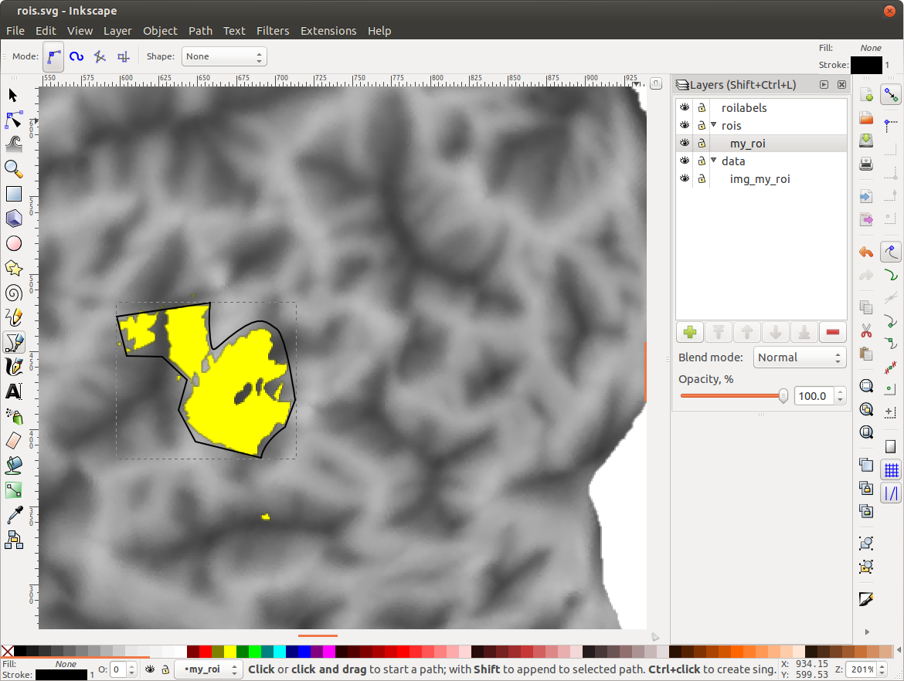

Surface-defined ROIs
====================

pycortex supports a method of defining surface ROIs using Inkscape. The ROIs are rendered as surface textures in the viewers, and roi masks can be extracted using helper functions.

Extracting voxel ROI masks for existing ROIs
--------------------------------------------

If ROIs have already been defined for a given subject, volume masks can be 
retrieved for them using the ``cortex.get_roi_mask`` and 
``cortex.get_roi_masks``. 

Defining surface ROIs using Inkscape
------------------------------------

Regions of interest (ROIs) are patches of cortex that have been identified as useful landmarks. In pycortex they can be delineated on the cortical surface.

An ROI is traced by hand as a closed contour on the flattened cortical surface according to some information we are given. In the case of functional ROIs, this information can be contrast maps from functional localizers, identifying e.g. retinotopic visual areas and known and accepted specialized functional modules such as face, place and body areas.

Here we explain how to trace the ROIs according to such a localizer image, 
which we create synthetically as a small sphere in the volume, centered around
an arbitrary voxel.

.. code-block:: python

    # code to generate a synthetic localizer image
    import cortex
    import numpy as np
    mask = cortex.get_cortical_mask("S1", "fullhead")
    s1, s2, s3 = mask.shape
    center_point = np.array([15, 70, 65])
    grid = np.mgrid[0:s1, 0:s2, 0:s3]
    squared_distances = (
              (grid.T - center_point) ** 2).T.sum(axis = 0)
    roi = (squared_distances <= 16).astype(float)
    roi[roi == 0.] = np.nan # set 0 to nan for transparency

Assuming the contrast image is a volume image loaded into a numpy array named ``roi`` (e.g. the one created above, or a real fMRI contrast), we create a 
``pycortex.Volume`` object determining how to visualize the roi:

.. code-block:: python

    # cortex.Volume object for visualization
    data_volume = cortex.Volume(roi, subject="S1", xfmname="fullhead",
                                cmap="autumn", vmin=0., vmax=1.)

Note that the data volume also contains specifications of how it is to be 
visualized. The data volume, projected onto the cortical flatmap will serve as
a guide to drawing the ROI contour using inkscape.

For the next step, make sure that a flatmap exists for the subject and that
inkscape is installed. Choosing the name `my_roi`, the following function call opens an inkscape instance:

.. code-block:: python

    # open inkscape to draw ROI:
    # specify with_curvature=True if you need visual guidance through an
    # underlying curvature map.
    cortex.add_roi(data_volume, name="my_roi", with_curvature=True)

The inkscape instance should look as follows:

Zoom in and select the ``Layers...`` widget from the ``Layers`` menu or hit ``Shift-Ctrl-L``:

The layer ``data/img_my_roi`` contains the flatmap visualization of the ``data_volume`` created earlier. The layer ``rois/my_roi`` shall contain the definition of the ROI.

In order to define the ROI, select the layer ``rois/my_roi`` and select the Bezier curve/straight line tool from the tool bar. Trace a closed contour around the ROI.

Save (to ``rois.svg`` opened by inkscape) and close inkscape.

Check the roi in a pycortex viewer:

.. code-block:: python

    import cortex
    roi_masks = cortex.get_roi_mask("S1", "fullhead", "my_roi")
    my_roi_mask = roi_masks["my_roi"].copy()
    my_roi_mask[my_roi_mask == 0.] = np.nan  # for transparency
    mask_data_volume = cortex.Volume(my_roi_mask, subject="S1", 
                           xfmname="fullhead", cmap="autumn",
                           vmin=0., vmax=1.)
    viewer = cortex.webgl.show(mask_data_volume, recache=True)
 
.. image:: my_roi_in_viewer.png

